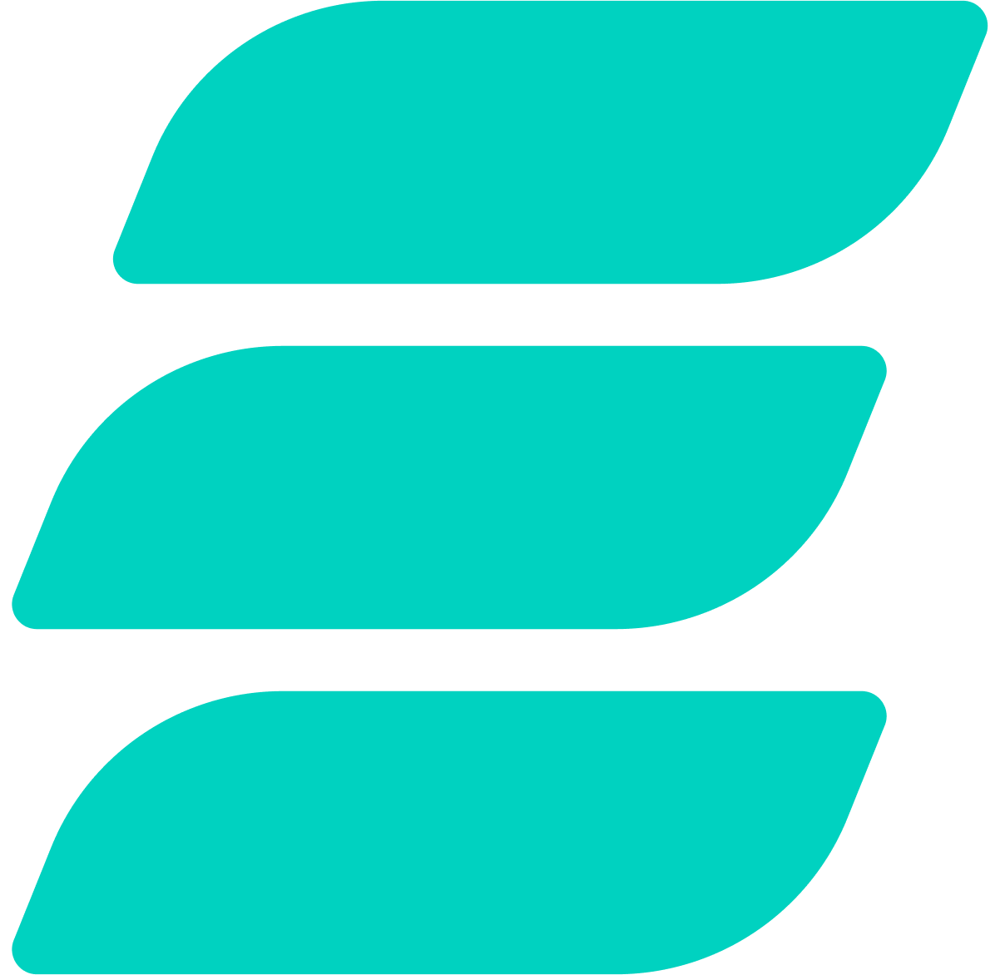

#  Emittio

*Anonymous, decentralized email. Powered by IPFS & end-to-end encryption.*

🌐 [Website](https://emittio.vercel.app/) | 📣 [Telegram](https://t.me/EmittioMail)

## Why Emittio?

> A next-gen email protocol designed for anonymity, resilience, and full user control.

We're building a mail system that is:

- 🕸️ **Decentralized** — no central servers, no single point of failure.
- 🔐 **End-to-end encrypted** — only sender and recipient can read the content.
- 👤 **Anonymous** — no IDs or accounts
- ⚡️ **Efficient** — fast delivery

## 🏠 Architecture

In other words, how it works.

| Component | Role |
|-|-|
| **Inbox** | A public key that acts as a mailbox identifier |
| **Session** | A secret seed used to derive inbox keys (no accounts are stored on the network) |
| **Envelope** | An encrypted message. Metadata (sender, recipient, time) is also encrypted. Each envelope includes a lookup pointer derived from a shared secret with the recipient. |
| **DHT** | Allows to store and find encrypted mails in network |
| **Mixnet** | Routes onion-like data through 3 hops (prevents IP correlation) and sends a lot of dummy requests (partially prevents timing correlation) |
| **Nodes** | Save encrypted content and forward onion-like messages |

### Optimization components

| Component | Role |
|-|-|
| **Tags** | Small encrypted metadata used to optimize lookups |
| **Quorums** | Temporary node groups that reduce network-wide scanning |

## 🛣️ Roadmap

1. [x] Alice-Bob cryptography system prototype in Rust
2. [x] `Client`, `Node` and `MockTransport` abstractions
3. [x] Tags, their storage and lookup
4. [ ] DHT
5. [ ] QUIC and/or TCP transports
6. [ ] Mixnet (onion-like routing & dummy requests)
7. [ ] Quorums
8. [ ] UX & UI prototyping
9. [ ] Svelte web client

## 🟢 Status

Currently working on the MVP; looking for feedback on architecture.

## 🛠️ Tech Stack

- X25519 and Kyber512 for shared secret
- Ed25519 and dilithium for signatures
- ChaCha20Poly1305 for envelopes and AES-GCM for onion traffic and tags
- BLAKE3 for hashes and SHA256 for PoW hashes
- DHT on QUIC protocol
- Rust (nodes)
- Svelte + WASM (web client)

## ❤️ Support

- BTC: `bc1qq90dh06ah92sg6unfnsn0edx9l9a9msfpagh3f`
- ETH: `0xB9be3CbB7Dc9f9C104640899AeF4A1b4147f9e21`
- SOL: `6evKWq8jEVJS1GiaNp7XhKQqZQg4jzacV96KbGLoHLwV`
- XMR: `87T3MAroNFfBKE7hvUphVFjfYSgaB6a7qVpvrs9hDAcMMJ413bEeyLAe77j7NnfYeF22PPVbwues9C4Ce2z4N7zv3rXE1Do`

> ⚠️ Project in early R&D stage. Looking for early feedback & sponsors. Contributors welcome after MVP.