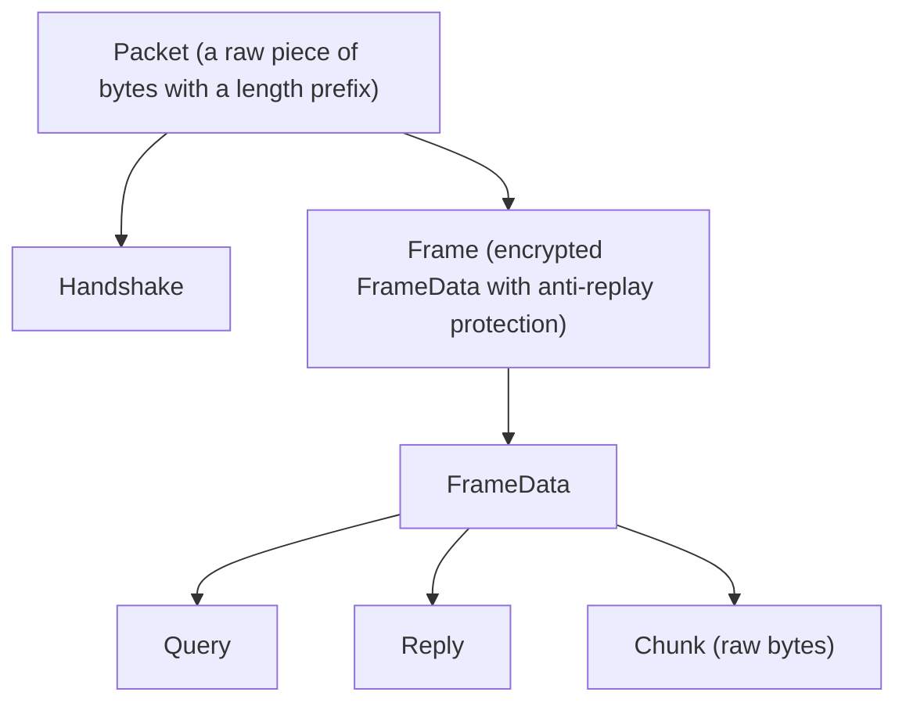

# `emittio-network` Architecture

`emittio-network` crate is responsible of handling connections and establishing sessions between peers using hybrid-RTT handshake and post-quantum KEM.

Hybrid-RTT means that the first payload is sent using 0-RTT session, but before first reply, it upgrades to 1-RTT session.

## Message hierarchy

## Session

Encrypts and decrypts frame data. Handles nonces and protects from replays.

## Flows

### Network service

### Alice - Bob communication example

